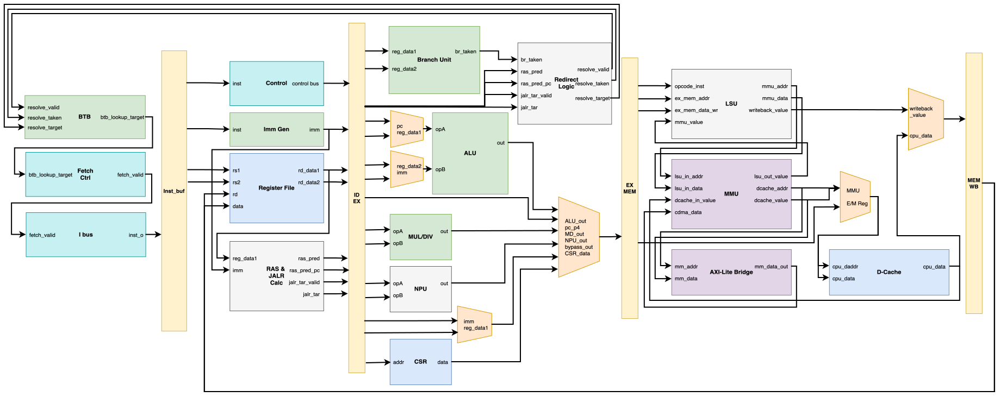
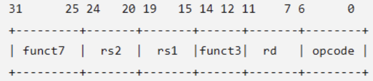
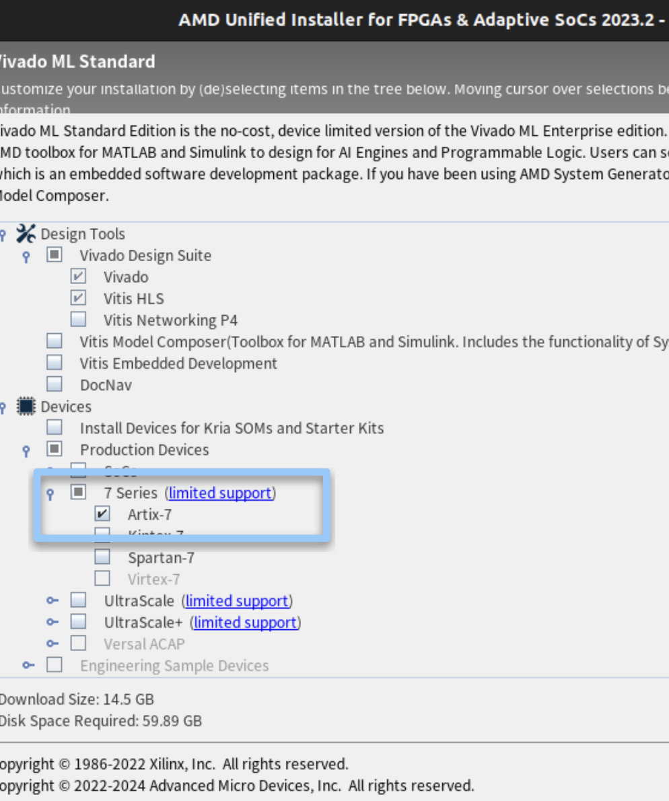
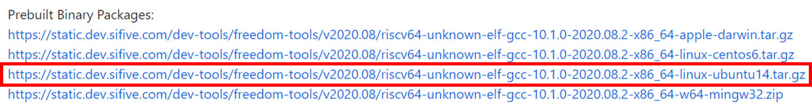

# TinyRISC-V SoC Platform 

## Table of Contents 
- [Understand the TinyRISC-V SoC platform.](#tinyrisc-v-soc-platform)
- [Set up Vivado and the RISC-V toolchain.](#toolchain-setup)
- [Clone and set up the `TinyRISC-V SoC Platform`.](#platform-setup)
- [Program the FPGA and run a TFLM application.](#running-the-platform)
## Introduction
Throughout AAML 2026, we will use the TinyRISC-V SoC Platform to explore hardware/software co-design for machine-learning acceleration. The platform integrates a RISC-V CPU, a customizable ML accelerator connected through custom instructions and AXI, and TensorFlow Lite for Microcontrollers (TFLM). In Lab 0, you will set up the required tools, program the reference SoC onto the FPGA, and run a reference TFLM application to verify the development environment for the following labs.

## TinyRISC-V SoC Platform

### RISC-V CPU
For a CPU to function, it must rely on the Instruction Set Architecture (ISA). An instruction set is a predefined list of commands that determines which operations the hardware can understand and execute. In this Lab, we use **RISC-V**, an open source ISA.  

Our CPU supports RV32IM, with M-mode only supporting `mcycle` and `mcycleh`, and it also supports the `fence.i` instructions.  

Moreover, the hardware supports `CBO` (Cache-Block Management Operations). We implement the `zicbom` extension, which allows software to manually manage cache coherence by cleaning or invalidating cache blocks.


### Extended ISAs
ISA is divided into two levels: the Base ISA and the Extended ISAs.  

- Base ISA: For RV32I as an example. it only defines the basic integer instructions that a CPU must support, such as `add`, `lw`, `sw`, and `beq`.
- Extended ISA: Depending on specific computational needs — such as floating-point arithmetic, vector and matrix processing, or even AI tensor operations — we can selectively incorporate these extensions into CPU designs.
  
The official specification reserves blank opcodes (such as custom-0), allowing developers like us to extend R-type formatted custom instructions.  


- We referenced custom-0 and R-type
- Custom-0 is an opcode retained by the official
- NPU can be controlled by function3 and function7

**Adding A Custom Instruction**
1. Choose a `funct3/funct7` pair. `cfu_op0`..`cfu_op7` select `funct3=0..7`
3. Implement the hardware behavior in `../hw/srcs/NPU.v`, or start from `../hw/templates/custom_accelerator_template.v`
3. Implement the software fallback in `app/software_cfu.cc`
4. Add a functional or cycle-counting test in `project/<your own test>.cc` or another project source, then register it in the appropriate Lab submenu in `project/proj_menu.cc`  

Build with `USE_SOFTWARE_CFU=1` when you want to test the software fallback without issuing `CUSTOM-0` instructions.  
Use `templates/custom_instruction_template.cc` for a standalone performance test skeleton. After adding template-based code, run `make validate`; if the extension adds a new menu item, register its function in the appropriate Lab submenu in `project/proj_menu.cc`.

### NPU (block)
In this platform, `NPU` is the name of the customizable accelerator block connected to the RISC-V CPU. The CPU still runs the application and the TFLM interpreter and remains responsible for program control. Software explicitly invokes the NPU only for selected compute-intensive operations.

The CPU communicates with the NPU through a request-response interface based on a `CUSTOM-0` instruction. `funct3` and `funct7` select the operation, while `rs1` and `rs2` provide two 32-bit operands. The CPU asserts `NPU_start` to begin an operation, which may take one or more cycles. When the operation finishes, the NPU places a 32-bit result on `NPU_out` and asserts `NPU_done`; the CPU then writes the result to `rd` and continues execution.

```
                      CUSTOM-0 request/result
+--------------------+ <=====================> +--------------------+
| RISC-V CPU         |                         | Customizable NPU   |
| Application + TFLM |                         | Compute / Control  |
+---------+----------+                         +----------+---------+
          | CPU cache / AXI                               | AXI4 master
          +-------------------+     +---------------------+
                              v     v
                         AXI Interconnect
                                |
                           Shared DDR3
```

### AXI
We provide a handy introduction to the basic concepts of AXI to help you with Lab 1 and Lab 2. </br>
Make sure to use your NYCU account to have access to these slides.

> [Learn more about AXI](https://docs.google.com/presentation/d/1PH9ZFxNuDXuPgTCY71MiiTLlWc80MGeT7lYO-IY-NLg/edit?usp=sharing)


### TensorFlow Lite For Micro (TFLM)
TfLM (Tensorflow Lite for Microcontrollers) is designed to run machine learning models on microcontrollers and other devices with only a few kilobytes of memory.  
  
Based on TFLM architecture, the standard procedure for switching existing models and importing new models:  
- Select
    1. List bundled models
        ```
        make models
        make profiles
        make templates
        // Bare MODEL_FILE values are resolved under MODEL_DIR, which defaults to models.
        ```
    2. Bundled profiles:
        ```
        ad01          ad01_int8.tflite fixture input and golden output
        ```
    3. Build a specific model:
        ```
        make MODEL_FILE=ad01_int8.tflite
        ```
    4. Select a profile explicitly:
        ```
        make MODEL_FILE=my_model.tflite MODEL_PROFILE=my_model
        make MODEL_FILE=ad01_int8.tflite MODEL_PROFILE=ad01
        ```
- Add
    1. Copy it into `Platform/sw/models`.
    2. Register any missing kernels in `project/tflm_ops.cc`.
    3. Start with `templates/model_profile_template.cc` if fixture data is not ready.
    4. Create `models/<profile>_profile.cc` when the model needs fixture input, generated input, custom tensor handling, or golden-output verification. Use `templates/model_profile_template.cc` as the starting pattern.
    5. Implement `const ModelProfile* model_profile_get(void)`.
    6. For simple int8 models, fill `input_data` and `expected_output`.
    7. For custom tensor types, generated inputs, or multi-output checks, set the `prepare_input` or `verify_output` function pointers.
    8. Set `TENSOR_ARENA_SIZE` if the model needs a larger arena.
    9. Run `make validate`, then build with `make MODEL_FILE=<name>.tflite`.
## Porting TinyRISC-V SoC to FPGA
This section will guide you through the core three steps from installing the toolchain, cloning the platform, to running the platform.

### Toolchain Setup
#### Step 0: Get Your FPGA Board
**Arty A7-100T** is used in this course, contact the TAs if you haven't get one.
#### Step 1: Install Vivado
- Install Vivado
We recommend you use version 2023.2 or version 2024.1
> [Vivado Download page](https://www.xilinx.com/support/download/index.html/content/xilinx/en/downloadNav/vivado-design-tools/2023-2.html)

```{note}
For Windows users, please install **all of your toolchains** under **WSL (Ubuntu)** rather than on Windows to prevent any environment setup issues.
```

- Add vivado to your PATH
- Make sure vivado is installed correctly on your machine before you start by running:
``` bash
$ vivado -version
```
- Since the full package of Vivado is pretty big, you may check only the `Artix-7` option to save disk space and download time, and please note that the Vivado can take up to 8 hours to download, so plan to do that ahead of time!

#### Step 2: Install RISC-V toolchain ([Download linux-ubuntu](https://github.com/sifive/freedom-tools/releases/tag/v2020.08.0))
Open your terminal and execute the following commands to download and extract the toolchain:


Download the August 2020 toolchain from freedom-tools and unpack the binaries to your home directory:
``` bash
$ tar xvfz ~/Downloads/riscv64-unknown-elf-gcc-10.1.0-2020.08.2-x86_64-linux-ubuntu14.tar.gz
```

Add the toolchain to your PATH in your `.bashrc` or `.zshrc`:
``` bash
export PATH=$HOME/riscv64-unknown-elf-gcc-10.1.0-2020.08.2-x86_64-linux-ubuntu14/bin:$PATH
```

### Platform Setup

#### Step 0: Initial Preparation
Prepare a clean directory in your Linux environment and navigate into it.
#### Step 1: Clone the Repository
```bash
touch {your folder name}
cd {your folder name}
git clone git@github.com:nycu-caslab/TinyRISC-V-SoC-Platform.git
```
#### Step 2: Set Permissions
```bash
cd CUSTOM_SoC_Platform/Platform
chmod +x hw/run_hw.sh
```
#### Step 3: Run the Pre-flight check
```bash
vivado -version
riscv64-unknown-elf-g++ --version
python3 -c "import serial"
make -C Platform/sw validate
make -C Platform/sw check-env
```

### Running the Platform
#### Step 1: Hardware Synthesis and FPGA Bitstream Programming
- Connect the FPGA board to your machine by the USB port
- Run the following command to synthesize the hardware and program the bitstream into the FPGA board
```bash
make prog
```
- Make sure this step is done correctly before moving to the next step

#### Step 2: Running the Software

- Run the following command to compile the software application and initiate interaction with the FPGA
```bash
make run MODEL_FILE=ad01_int8.tflite MODEL_PROFILE=ad01
```
Or 
```bash
make run
```
if the project.mk file has been set.

- When you see the line "Listening on /dev/ttyUSB1 for BIOS/App" on your terminal, press the CPU Reset button.
- After that, you should see the menu on your terminal that you can play around with.
